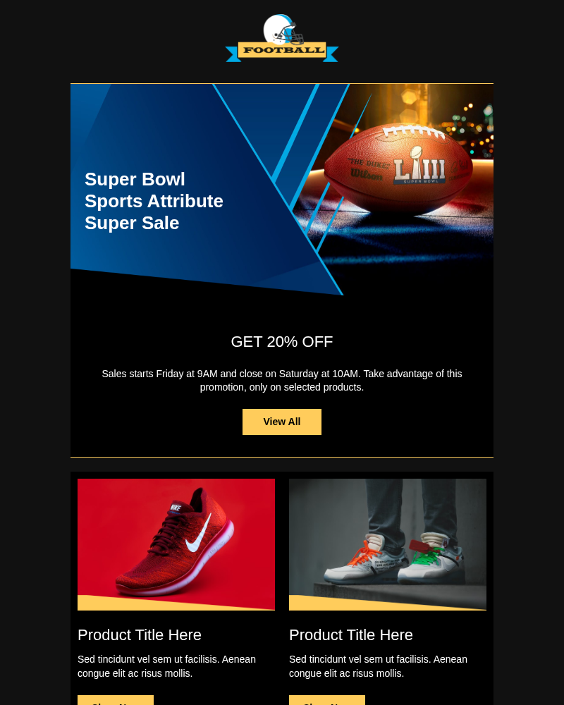

# Super Bowl Sports Attribute Shop

Professional email template for marketing a sports-themed store during the Super Bowl event.



## Template Details

- **Industries:** Sports & Entertainment
- **Message Type:** Marketing
- **Tags:** promotion, event, sports, super bowl, shop

## Files
- `index.html`: The improved, localized, and branded HTML template.
- `template.blade.php`: Ready-to-use Laravel Blade template with `asset()` helpers.
- `assets/`: Directory containing localized images and styles used in the template.

## Usage in Laravel

### 1. Store the Template
Place the `index.html` content in a Blade view (e.g., `resources/views/emails/super-bowl-sports-attribute-shop.blade.php`).

### 2. Handle Assets
Move the content of `assets/` to your public directory (e.g., `public/vendor/mail-templates/super-bowl-sports-attribute-shop/`) and update the paths in the HTML to use the `asset()` helper.

### 3. Send Email
```php
Mail::to($user)->send(new \App\Mail\GenericEmail([
    'view' => 'emails.super-bowl-sports-attribute-shop',
    'data' => [
        // Your dynamic data here
    ]
]));
```

---
*Created with ❤️ by **[LaravelMail.com](https://laravelmail.com)** - Your source for professional email templates.*
